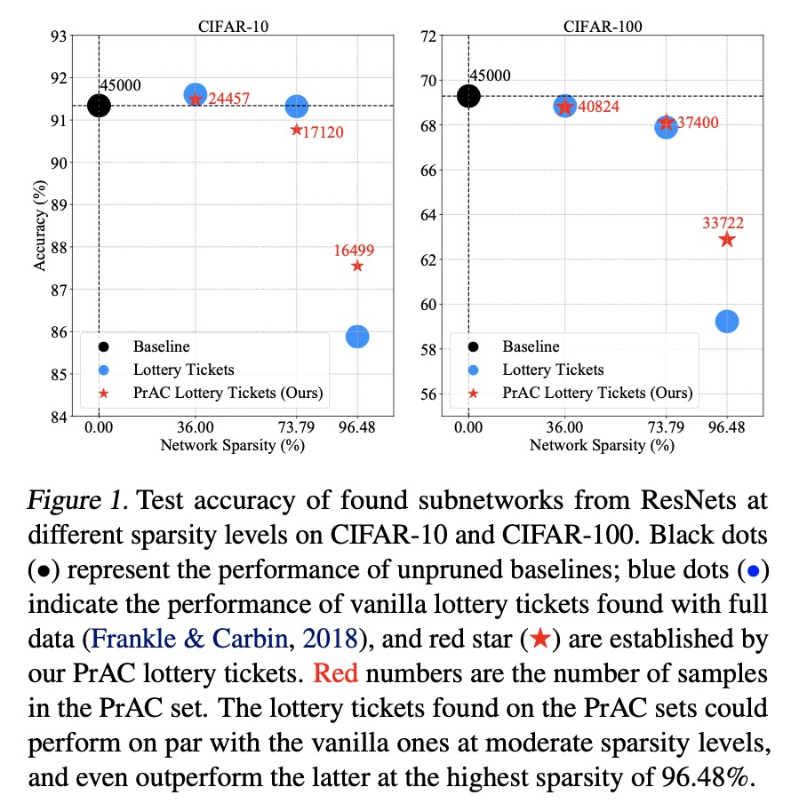

# Efficient Lottery Ticket Finding: Less Data is More

[](https://opensource.org/licenses/MIT)

Codes for this paper Efficient Lottery Ticket Finding: Less Data is More. [ICML 2021]

Zhenyu Zhang\*, Xuxi Chen\*, Tianlong Chen\*, Zhangyang Wang


## Overview

The lottery ticket hypothesis (LTH) reveals the existence of winning tickets (sparse but critical subnetworks) for dense networks, that can be trained in isolation from random initialization to match the latter’s accuracies. However, finding winning tickets requires burdensome computations in the train-prune-retrain process, especially on large-scale datasets (e.g., ImageNet), restricting their practical benefits. This paper explores a new perspective on finding lottery tickets more efficiently, by doing so only with a specially selected subset of data, called Pruning- Aware Critical set (PrAC set), rather than using the full training set. The concept of PrAC set was inspired by the recent observation, that deep networks have samples that are either *hard to memorize* during training, or *easy to forget* during pruning. A PrAC set is thus hypothesized to capture those most challenging and informative examples for the dense model. We observe that a high-quality winning ticket can be found with training and pruning the dense network on the very compact PrAC set, which can substantially save training iterations for the ticket finding process.



## Prerequisites

```
Pytorch >= 1.4

torchvision

advertorch
```

## Usage

#### Vanilla Lottery Tickets

```
python -u main_imp.py \
	--data data/cifar10 \
	--dataset cifar10 \
	--arch res20s \
	--batch_size 128 \
	--lr 0.1 \
	--pruning_times 16 \
	--prune_type rewind_lt \
	--rewind_epoch 2 \
	--save_dir lt_cifar10_res20s
```

#### PrAC Lottery Tickets

```
python -u main_PrAC_imp.py \
	--data data/cifar10 \
	--dataset cifar10 \
	--arch res20s \
	--split_file npy_files/cifar10-train-val.npy \
	--batch_size 128 \
	--lr 0.1 \
	--pruning_times 16 \
	--eb_eps 0.08 \
	--prune_type rewind_lt \
	--rewind_epoch 2 \
	--threshold 0 \
	--save_dir PrAC_lt_cifar10_res20s
	
```

#### Train subnetworks 

```
python -u main_train.py \
	--data data/cifar10 \
	--dataset cifar10 \
	--arch res20s \
	--batch_size 128 \
	--lr 0.1 \
	--init_dir PrAC_lt_cifar10_res20s/1checkpoint.pth.tar \ 
	--mask_dir PrAC_lt_cifar10_res20s/1checkpoint.pth.tar \ # sparsity=20%
	--save_dir retrain_PrAC_lt_cifar10_res20s/1
```

## Citation

```

```

